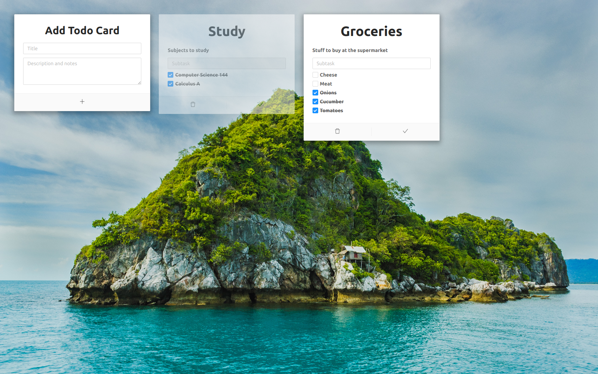

# Fare Website
Fare (fà·re) meaning "to do" in Italian is a todo application prototype I made using ReactJS. 

At the moment you are able to add a Todo Card through using the Add Todo Card form. You can then add subtasks to that card by placing the text into the input and pressing enter. After adding a subtask you can choose to either checking the box, edit it by doubling clicking on the text or delete it by
 - Editing the title (double click on text) and removing all characters and pressing enter 
 - Hovering over the subtask and clicking on the bin.
 
You are also able to set the Todo Card to completed, making it uneditable and fade away or delete it by clicking on the bin icon.

### Tech Stack 
- HTML
- CSS
- JavaScript
- ReactJS
- Ant Design
- Heroku
- NodeJS
- MongoDB

### Features
- Responsive Design
- Add, Edit and Delete Todocards
- Add, Edit and Delete Subtasks 

<b>Source code:</b> [GitHub](https://github.com/bitVivAZ/fare)

### Screenshots

